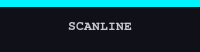

<div align="center">

```
  ▄▄▄  ██▀▄ ▄▄▄  ▄▄▄  ██▀▄ ██▀
  ▄▄▀▀ ██ █ ██   ██ █  ██ █ ██▄
  ██▀▀ ██▀▄ ██   ██▀▀▄ ██▀▄ ██
  ██▄▄ ██ ▀ ▀▀▀  ██▄▄▀ ██ ▀ ▀▀▀  UI
```

**80s arcade-style UI component library**  
Neon palette · Pixel animations · Built-in SFX · Zero runtime dependencies

[](https://www.npmjs.com/package/@davide03memoli/arcade-ui)
[](./LICENSE)
[](https://github.com/davidememoli03/Arcade-UI/actions/workflows/ci.yml)
[](https://davidememoli03.github.io/Arcade-UI/)

</div>

---

## ⚡ Quick Start — CDN

No build tools. Drop three lines into any HTML file and you're done:

```html
<link rel="stylesheet" href="https://cdn.jsdelivr.net/npm/@davide03memoli/arcade-ui@1/dist/arcade-ui.min.css">
<script type="module" src="https://cdn.jsdelivr.net/npm/@davide03memoli/arcade-ui@1/dist/arcade-ui.es.js"></script>
```

```html
<button class="arc-btn arc-btn-primary">INSERT COIN</button>
```

---

## 📦 Quick Start — npm

```bash
npm install @davide03memoli/arcade-ui
```

```js
// main.js / main.ts
import '@davide03memoli/arcade-ui/dist/arcade-ui.css'
import { AudioManager } from '@davide03memoli/arcade-ui'
```

```html
<button class="arc-btn arc-btn-primary">INSERT COIN</button>
```

---

## 🎮 Full Example

A complete working page — copy, save as `index.html`, open in browser:

```html
<!DOCTYPE html>
<html lang="en">
<head>
  <meta charset="UTF-8">
  <meta name="viewport" content="width=device-width, initial-scale=1.0">
  <title>Arcade UI Demo</title>

  <!-- Fonts (optional, recommended) -->
  <link rel="preconnect" href="https://fonts.googleapis.com">
  <link rel="preconnect" href="https://fonts.gstatic.com" crossorigin>
  <link href="https://fonts.googleapis.com/css2?family=Press+Start+2P&family=VT323&family=Share+Tech+Mono&display=swap"
        rel="stylesheet">

  <!-- Arcade UI -->
  <link rel="stylesheet"
        href="https://cdn.jsdelivr.net/npm/@davide03memoli/arcade-ui@1/dist/arcade-ui.min.css">

  <style>
    body {
      background: var(--arc-color-bg);
      display: flex;
      align-items: center;
      justify-content: center;
      min-height: 100vh;
      margin: 0;
    }
  </style>
</head>
<body>

  <div class="arc-panel arc-panel-cyan" style="max-width: 420px; width: 100%;">
    <div class="arc-panel-header">
      <span class="arc-glow-cyan" style="font-family: var(--arc-font-pixel); font-size: .85rem;">
        GAME OVER
      </span>
      <span class="arc-badge arc-badge-red arc-badge-pulse" style="margin-left: auto;">
        RANK #1
      </span>
    </div>

    <div class="arc-panel-body">
      <div class="arc-input-wrapper">
        <label class="arc-label">ENTER YOUR NAME</label>
        <input class="arc-input" placeholder="AAA" maxlength="3">
      </div>
    </div>

    <div class="arc-panel-footer">
      <button class="arc-btn arc-btn-primary">SAVE SCORE</button>
      <button class="arc-btn arc-btn-ghost">SKIP</button>
      <button class="arc-btn arc-btn-danger" data-arc-sound-click="gameover">QUIT</button>
    </div>
  </div>

  <!-- Audio (built-in Web Audio synth — no files needed) -->
  <script type="module">
    import { AudioManager } from 'https://cdn.jsdelivr.net/npm/@davide03memoli/arcade-ui@1/dist/arcade-ui.es.js'
    const audio = AudioManager.getInstance()
    audio.bindButtons(document.body)
  </script>

</body>
</html>
```

---

## 📋 Components

| Component | Classes | Variants | Storybook |
|-----------|---------|----------|-----------|
| **Button** | `.arc-btn` | `arc-btn-primary` · `arc-btn-ghost` · `arc-btn-danger` · `arc-btn-sm` · `arc-btn-lg` | [→ Demo](https://davidememoli03.github.io/Arcade-UI/?path=/story/components-button--primary) |
| **Tabs** | `.arc-tabs` · `.arc-tab-list` · `.arc-tab` · `.arc-tab-panel` | `arc-tabs-cyan` · `arc-tabs-magenta` · `arc-tabs-yellow` · `arc-tabs-green` · `arc-tabs-red` · `arc-tabs-purple` | [→ Demo](https://davidememoli03.github.io/Arcade-UI/?path=/story/components-tabs--multi-panel-demo) |
| **Card** | `.arc-card` | `arc-card-cyan` · `arc-card-red` · `arc-card-yellow` · `arc-card-green` · `arc-card-purple` · `arc-card-glow` · `arc-card-selected` · `arc-card-locked` | [→ Demo](https://davidememoli03.github.io/Arcade-UI/?path=/story/components-card--character-select-screen) |
| **Avatar** | `.arc-avatar` · `.arc-avatar-inner` · `.arc-avatar-placeholder` · `.arc-avatar-status` | `arc-avatar-sm` / `arc-avatar-lg` / `arc-avatar-xl` · `arc-avatar-frame-neon` / `gold` / `silver` / `bronze` · `arc-avatar-status-online` / `offline` · `arc-avatar-active` | [→ Demo](https://davidememoli03.github.io/Arcade-UI/?path=/story/components-avatar--character-select-grid) |
| **Display 7-seg** | `.arc-display` · `.arc-display-body` · `.arc-display-digit` · `.arc-display-sep` | `arc-display-score` · `arc-display-timer` · `arc-display-red` / `green` / `amber` / `cyan` · JS: `setArcDisplayValue`, `arcCountdown` | [→ Demo](https://davidememoli03.github.io/Arcade-UI/?path=/story/components-display--score-counter) |
| **Sprite** | `.arc-sprite` | `arc-sprite-bg-dark` · `arc-sprite-bg-panel` · `arc-sprite-paused` · `arc-sprite-pixelated` · `arc-sprite-loop-once` · `arc-sprite-grid` · `arc-sprite-gif` · JS `arcSprite` | [→ Demo](https://davidememoli03.github.io/Arcade-UI/?path=/story/components-sprite--sprite-sheet-strip) |
| **Panel** | `.arc-panel` | `arc-panel-cyan` · `arc-panel-red` · `arc-panel-yellow` · `arc-panel-green` · `arc-panel-purple` · `arc-panel-glass` | [→ Demo](https://davidememoli03.github.io/Arcade-UI/?path=/story/components-panel--default) |
| **Input** | `.arc-input` · `.arc-label` | `.arc-textarea` · `.arc-select` · `.arc-input-hint` · `.arc-input-hint-error` | [→ Demo](https://davidememoli03.github.io/Arcade-UI/?path=/story/components-input--default) |
| **Dropdown** | `.arc-dropdown` | `arc-dropdown-cyan` · `arc-dropdown-green` · `arc-dropdown-red` · `arc-dropdown-yellow` · `arc-dropdown-purple` | [→ Demo](https://davidememoli03.github.io/Arcade-UI/?path=/story/components-dropdown--default) |
| **Modal** | `.arc-modal` · `.arc-modal-backdrop` | `arc-modal-cyan` · `arc-modal-green` · `arc-modal-yellow` · `arc-modal-red` · `arc-modal-purple` | [→ Demo](https://davidememoli03.github.io/Arcade-UI/?path=/story/components-modal--default) |
| **Progress** | `.arc-progress` · `.arc-progress-bar` | `arc-progress-cyan` · `arc-progress-green` · `arc-progress-yellow` · `arc-progress-red` · `arc-progress-purple` | [→ Demo](https://davidememoli03.github.io/Arcade-UI/?path=/story/components-progress--all-colors) |
| **Tooltip** | `[data-tooltip]` | `arc-tooltip-top` · `arc-tooltip-bottom` · `arc-tooltip-left` · `arc-tooltip-right` | [→ Demo](https://davidememoli03.github.io/Arcade-UI/?path=/story/components-tooltip--all-positions) |
| **Badge** | `.arc-badge` | `arc-badge-cyan` · `arc-badge-red` · `arc-badge-yellow` · `arc-badge-green` · `arc-badge-purple` · `arc-badge-outline` · `arc-badge-pulse` | [→ Demo](https://davidememoli03.github.io/Arcade-UI/?path=/story/components-badge--default) |
| **Accordion** | `.arc-accordion` | `arc-accordion-cyan` · `arc-accordion-red` · `arc-accordion-yellow` · `arc-accordion-green` | [→ Demo](https://davidememoli03.github.io/Arcade-UI/?path=/story/components-accordion--default) |
| **Glow** | `.arc-glow-{color}` · `.arc-box-glow-{color}` | cyan · red · yellow · green · purple | [→ Demo](https://davidememoli03.github.io/Arcade-UI/?path=/story/effects-glow--text) |
| **Text effects** | `.arc-text-neon` · `.arc-text-gradient` · `.arc-text-outline` · `.arc-text-glitch` · `.arc-text-shadow-long` · `.arc-text-chroma` · `.arc-text-pixel-shadow` | `--arc-text-neon-color` · `--arc-text-gradient-start` / `end` · outline / long / chroma / glitch / pixel tokens | [→ Demo](https://davidememoli03.github.io/Arcade-UI/?path=/story/effects-text-effects--showcase) |
| **Glitch** | `.arc-glitch` · `.arc-glitch-hover` | — | [→ Demo](https://davidememoli03.github.io/Arcade-UI/?path=/story/effects-glitch--always-on) |
| **Pixel border** | `.arc-border-pixel` · `.arc-border-pixel-thick` · `.arc-border-pixel-inset` · `.arc-border-pixel-chamfer` · `.arc-border-pixel-glow` | `--arc-border-color` | [→ Demo](https://davidememoli03.github.io/Arcade-UI/?path=/story/effects-pixel-border--showcase) |
| **CRT** | `.arc-crt-screen` · `.arc-crt-global` | `.arc-crt-boot` · token curvatura / vignetta / flicker / aberrazione / fosforo | [→ Demo](https://davidememoli03.github.io/Arcade-UI/?path=/story/effects-crt--screen) · [Playground](https://davidememoli03.github.io/Arcade-UI/?path=/story/effects-crt--playground) |
| **Background patterns** | `.arc-bg-grid` · `.arc-bg-dots` · `.arc-bg-scanlines` · `.arc-bg-noise` · `.arc-bg-circuit` · `.arc-bg-stars` | `--arc-bg-opacity` · `--arc-bg-grid-cell` · `--arc-bg-dots-gap` · `--arc-bg-scanline-period` · `--arc-bg-stars-speed` | [→ Demo](https://davidememoli03.github.io/Arcade-UI/?path=/story/effects-background-patterns--all-patterns) |
| **Toggle** | `.arc-toggle` · `.arc-toggle-input` · `.arc-toggle-switch` · `.arc-toggle-label` | `arc-toggle-on` · `arc-toggle-off` · `arc-toggle-label-left` | [→ Demo](https://davidememoli03.github.io/Arcade-UI/?path=/story/components-toggle--all-states) |
| **Slider** | `.arc-slider` · `.arc-slider-wrapper` · `.arc-slider-label` · `.arc-slider-display` · `.arc-slider-ticks` | `arc-slider-danger` · `arc-slider-success` · `arc-slider-yellow` · `arc-slider-purple` | [→ Demo](https://davidememoli03.github.io/Arcade-UI/?path=/story/components-slider--volume-panel-demo) |
| **Table** | `.arc-table` · `.arc-table-wrapper` | `arc-table-cyan` · `arc-table-green` · `arc-table-yellow` · `arc-table-red` · `arc-table-purple` | [→ Demo](https://davidememoli03.github.io/Arcade-UI/?path=/story/components-table--leaderboard) |
| **Toast** | `.arc-toast` · `.arc-toast-container` | `arc-toast-info` · `arc-toast-success` · `arc-toast-warning` · `arc-toast-error` | [→ Demo](https://davidememoli03.github.io/Arcade-UI/?path=/story/components-toast--playground) |
| **Animations** | `.arc-anim-flicker` · `.arc-anim-blink-cursor` · `.arc-anim-insert-coin` · `.arc-anim-scanline-move` · `.arc-anim-static-noise` · `.arc-anim-power-on` · `.arc-anim-power-off` · `.arc-u-blink` · `.arc-u-pulse` · `.arc-u-glitch` | `--arc-flicker-speed` · `--arc-flicker-intensity` | [→ Demo](https://davidememoli03.github.io/Arcade-UI/?path=/story/effects-animations--showcase) |

### Tabs anatomy

Menu di navigazione a schede stile HUD arcade. Supporta due modalità di funzionamento senza conflitti.

**Modalità CSS-only** — zero JavaScript, usa `<input type="radio">` nascosti + selettori `:has()` + `:checked`:

```html
<div class="arc-tabs arc-tabs-cyan">
  <!-- radio inputs: uno per tab, stessa name, id unici -->
  <input class="arc-tab-radio" type="radio" name="my-tabs" id="tab-1" checked>
  <input class="arc-tab-radio" type="radio" name="my-tabs" id="tab-2">
  <input class="arc-tab-radio" type="radio" name="my-tabs" id="tab-3">

  <!-- tab bar: label collegati agli input via for= -->
  <div class="arc-tab-list" role="tablist">
    <label class="arc-tab" for="tab-1">STAGE 1</label>
    <label class="arc-tab" for="tab-2">STAGE 2</label>
    <label class="arc-tab" for="tab-3">STAGE 3</label>
  </div>

  <!-- pannelli contenuto: uno per tab, nello stesso ordine -->
  <div class="arc-tab-panel">Contenuto Stage 1</div>
  <div class="arc-tab-panel">Contenuto Stage 2</div>
  <div class="arc-tab-panel">Contenuto Stage 3</div>
</div>
```

> **Requisiti CSS-only:** Chrome 111+, Firefox 113+, Safari 14.1+ (`:has()` + `:nth-child(n of .class)`). Supporta fino a 6 tab.

**Modalità JS-driven** — aggiungere `data-arc-tabs` al contenitore e usare `<button>` nei tab; l'inizializzazione avviene automaticamente a `DOMContentLoaded`:

```html
<div class="arc-tabs arc-tabs-cyan" data-arc-tabs>
  <div class="arc-tab-list" role="tablist">
    <button class="arc-tab" role="tab">STAGE 1</button>
    <button class="arc-tab" role="tab">STAGE 2</button>
  </div>
  <div class="arc-tab-panel" role="tabpanel">Contenuto Stage 1</div>
  <div class="arc-tab-panel" role="tabpanel">Contenuto Stage 2</div>
</div>
```

```js
import { arcTabs, bindTabs } from '@davide03memoli/arcade-ui'

// Auto-bind tutti gli elementi [data-arc-tabs]
bindTabs()

// Oppure inizializza manualmente un singolo elemento
const tabs = arcTabs(document.querySelector('.arc-tabs'))
tabs.activate(2) // attiva il 3° tab (0-based)
```

Navigazione da tastiera conforme al pattern ARIA Tabs: `ArrowLeft`/`ArrowRight` per navigare, `Home`/`End` per il primo/ultimo tab.

**Varianti colore** — aggiungere a `.arc-tabs`:

| Classe | Uso consigliato |
|---|---|
| `arc-tabs-cyan` | Primary — HUD, pannelli principali |
| `arc-tabs-magenta` | Secondary — alert, sezioni speciali |
| `arc-tabs-yellow` | Coins, inventario, ricompense |
| `arc-tabs-green` | Salute, stato, completamento |
| `arc-tabs-red` | Pericolo, errori critici |
| `arc-tabs-purple` | Magia, poteri speciali |

### Card anatomy

Character-select card ispirata agli schermi di selezione personaggio arcade. Struttura a header/body/footer, doppio bordo neon e angoli pixel decorativi su tutti e 4 i lati.

```html
<div class="arc-card arc-card-cyan">
  <div class="arc-card-header">
    <div class="arc-card-avatar">🥷</div>
    <p class="arc-card-title">RYU</p>
    <p class="arc-card-subtitle">Street Fighter</p>
  </div>
  <div class="arc-card-body">
    <div class="arc-card-meta">
      <span class="arc-card-meta-key">STR</span>
      <span class="arc-card-meta-value">92</span>
    </div>
    <div class="arc-card-meta">
      <span class="arc-card-meta-key">SPD</span>
      <span class="arc-card-meta-value">85</span>
    </div>
  </div>
  <div class="arc-card-footer">
    <button class="arc-btn arc-btn-primary arc-btn-sm">SELECT</button>
  </div>
</div>
```

L'elemento `.arc-card-avatar` accetta testo (emoji, unicode), o un `` interno:

```html
<div class="arc-card-avatar">
  
</div>
```

**Varianti colore** — aggiungere a `.arc-card`:

| Classe | Colore |
|---|---|
| `arc-card-cyan` | Neon cyan (default) |
| `arc-card-red` | Neon red |
| `arc-card-yellow` | Neon yellow |
| `arc-card-green` | Neon green |
| `arc-card-purple` | Neon purple |

**Varianti stato** — aggiungere a `.arc-card`:

| Classe | Comportamento |
|---|---|
| `arc-card-glow` | Glow pulsante continuo |
| `arc-card-selected` | Bordo lampeggiante + label "▶ SELECT ◀" sotto la card |
| `arc-card-locked` | Opacità ridotta, saturazione desaturata, overlay con 🔒 |

> **Nota:** `arc-card-selected` e `arc-card-locked` usano entrambi lo pseudo-elemento `::after`. Non combinarli sullo stesso elemento.

### Avatar anatomy

Cornice **doppio anello** stile 8-bit attorno a un’area quadrata (`--arc-avatar-s`: 32 / 64 default / 128 / 256 px). Indicatore LED in basso a destra; `.arc-avatar-active` (o `.arc-avatar-selected`) attiva il **glow pulsante** sulla cornice (`prefers-reduced-motion` fissa l’alone).

```html
<div class="arc-avatar arc-avatar-lg arc-avatar-frame-gold arc-avatar-active">
  <span class="arc-avatar-status arc-avatar-status-online" aria-label="Online" title="Online"></span>
  <div class="arc-avatar-inner">
    
  </div>
</div>
```

**Placeholder iniziali** — stesso contenitore, senza `img`:

```html
<div class="arc-avatar arc-avatar-sm">
  <div class="arc-avatar-inner">
    <span class="arc-avatar-placeholder">DM</span>
  </div>
</div>
```

| Modificatore | Effetto |
|---|---|
| `arc-avatar-sm` | Lato interno 32px |
| *(nessuno)* | 64px |
| `arc-avatar-lg` | 128px |
| `arc-avatar-xl` | 256px |
| `arc-avatar-frame-neon` | Cyan cabinato (default se omesso, equivale a `.arc-avatar` solo) |
| `arc-avatar-frame-gold` / `silver` / `bronze` | Cornici rank |
| `arc-avatar-status-online` / `offline` | LED su `.arc-avatar-status` |
| `arc-avatar-active` | Pulse glow selezione |

Storybook: [Components / Avatar — Character select grid](https://davidememoli03.github.io/Arcade-UI/?path=/story/components-avatar--character-select-grid).

### Display a 7 segmenti (`.arc-display`)

Numeri e timer stile cabinato: glifi **DSEG7 Classic** ([SIL OFL](https://github.com/keshikan/DSEG)), caricati da jsDelivr nel CSS del pacchetto. **Fallback:** monospace (senza font non sono veri 7 segmenti).  
**Alternativa CSS puro:** nessun set di segmenti generico senza centinaia di regole per cifra; per un look fedele il font open source è la scelta pratica; in assenza di rete puoi **self-host** i file da [`@fontsource/dseg7-classic`](https://www.npmjs.com/package/@fontsource/dseg7-classic) e aggiornare l’`@font-face` in `display.css`.

**HTML minimo**

```html
<div
  class="arc-display arc-display-score arc-display-amber"
  role="status"
  aria-live="polite">
  <!-- opzionale: body vuoto, verrà creato da JS -->
</div>
```

**Da JavaScript**

```js
import { setArcDisplayValue, arcCountdown } from '@davide03memoli/arcade-ui'

setArcDisplayValue(element, 125400, { pad: 6 }) // HIGH SCORE a sei cifre

const ctrl = arcCountdown(timerElement, {
  seconds: 90,
  onTick: (r) => { /* … */ },
  onEnd: () => { /* … */ },
})
ctrl.stop()
```

**Varianti**

| Classe | Ruolo |
|--------|--------|
| `arc-display-score` | Corpo più grande (punteggi / crediti) |
| `arc-display-timer` | Taglia timer + lampeggio `:` (disabilita con `arc-display-sep-solid` sulla stessa root) |
| `arc-display-red` | LED rosso (default se ometti il colore) |
| `arc-display-green` · `arc-display-amber` · `arc-display-cyan` | Altre tinte |

**Data attributes** (init automatica su `DOMContentLoaded`): `data-arc-display`, valore in `data-arc-display-value`, padding opzionale `data-arc-display-pad`.

Al cambio cifra: flash breve sui soli segmenti mutati (`prefers-reduced-motion` lo disattiva).

Storybook: [Components / Display](https://davidememoli03.github.io/Arcade-UI/?path=/story/components-display--score-counter).

### Sprite sheet pixel-art (`.arc-sprite`)

Animazioni **CSS** (`@keyframes` + `steps()`) per fogli PNG esportati da **[Piskel](https://www.piskelapp.com/)** (o tool equivalenti). Formato consigliato: **strip orizzontale** (una riga di frame, stessa dimensione per ogni cella). Alternativa: **GIF** con markup `.arc-sprite-gif` (meno controllo su FPS / frame).

**Export da Piskel**

1. *Sprite sheet* — `Export` → *PNG* → **Spritesheet** (orizzontale o griglia regolare). Imposta *Scale* = 1× per pixel puri.
2. *GIF* — utile per prototipi; niente `steps()`, l’animazione è quella del file.

**Striscia orizzontale (1 riga)**

```html
<div
  class="arc-sprite arc-sprite-pixelated"
  role="img"
  aria-label="Eroe cammina"
  style="
    --arc-sprite-sheet: url('/sprites/hero-walk.png');
    --arc-sprite-frames: 4;
    --arc-sprite-width: 32px;
    --arc-sprite-height: 32px;
    --arc-sprite-fps: 8;
  "></div>
```

**Scala intera** (nitidezza cabinato): `--arc-sprite-scale: 4` (consigliato intero). Classe **`.arc-sprite-pixelated`** imposta `image-rendering: pixelated` / `crisp-edges`.

**Griglia multi-riga** — imposta `--arc-sprite-rows` (e un numero di frame multiplo: `frames = colonne × righe`). Aggiungi **`.arc-sprite-grid`** per disattivare l’animazione lineare in X e usa **`arcSprite.init(el)`** per il ciclo frame-by-frame.

```html
<div
  class="arc-sprite arc-sprite-grid arc-sprite-pixelated"
  style="
    --arc-sprite-sheet: url('/sprites/explosion.png');
    --arc-sprite-frames: 8;
    --arc-sprite-rows: 2;
    --arc-sprite-width: 16px;
    --arc-sprite-height: 16px;
    --arc-sprite-fps: 12;
  "></div>
```

```js
import { arcSprite } from '@davide03memoli/arcade-ui'

const sprite = arcSprite.init(document.querySelector('.arc-sprite'))
sprite.play()
sprite.pause()
sprite.setFps(12)
sprite.setFrame(2)
```

Su strip orizzontale, **`setFrame`** applica `.arc-sprite-paused` (l’animazione CSS non segue il frame “virtuale”); chiama **`play()`** per riprendere.

**GIF**

```html
<div class="arc-sprite arc-sprite-gif arc-sprite-pixelated" style="--arc-sprite-width: 32px; --arc-sprite-height: 32px; --arc-sprite-scale: 2;">
  
</div>
```

**Custom properties**

| Proprietà | Default | Descrizione |
|-----------|---------|-------------|
| `--arc-sprite-sheet` | — | `url(...)` del foglio PNG |
| `--arc-sprite-frames` | `1` | Numero totale di frame |
| `--arc-sprite-width` | `32px` | Larghezza di un frame nel PNG |
| `--arc-sprite-height` | `32px` | Altezza di un frame nel PNG |
| `--arc-sprite-fps` | `8` | Frames per secondo (strip) o timer griglia |
| `--arc-sprite-scale` | `1` | Scala moltiplicativa (idealmente intera) |
| `--arc-sprite-rows` | `1` | Righe nel foglio; con `> 1` usa `.arc-sprite-grid` + init JS |
| `--arc-sprite-cols` | `frames ÷ rows` | Calcolato automaticamente; sovrascrivi solo se il foglio è irregolare |
| `--arc-sprite-bg` | `transparent` | Colore di sfondo sotto lo sprite |
| `--arc-sprite-direction` | `normal` | `normal` · `reverse` · `alternate` (solo strip CSS) |

**Classi modificatore**

| Classe | Descrizione |
|--------|-------------|
| `arc-sprite-bg-dark` | Sfondo `#0a0a0a` |
| `arc-sprite-bg-panel` | Sfondo pannello + bordo neon |
| `arc-sprite-paused` | Congela l’animazione CSS (strip) |
| `arc-sprite-pixelated` | Scala nitida |
| `arc-sprite-loop-once` | Una sola ripetizione (`animation-iteration-count: 1`, strip) |
| `arc-sprite-grid` | Griglia: niente keyframe 1D; avanzamento via JS |
| `arc-sprite-gif` | Contenitore per `` |

`prefers-reduced-motion: reduce` disattiva l’animazione CSS sullo sprite sheet (primo frame fermo).

Storybook: [Components / Sprite](https://davidememoli03.github.io/Arcade-UI/?path=/story/components-sprite--sprite-sheet-strip).

### Panel anatomy

```html
<div class="arc-panel arc-panel-cyan">
  <div class="arc-panel-header">Title</div>
  <div class="arc-panel-body">Content</div>
  <div class="arc-panel-footer">
    <button class="arc-btn arc-btn-primary">OK</button>
  </div>
</div>
```

### Toggle anatomy

LED switch che imita i pulsanti fisici dei cabinati arcade. CSS-only tramite `<input type="checkbox">` — zero JavaScript.

```html
<!-- OFF (default) -->
<label class="arc-toggle">
  <input type="checkbox" class="arc-toggle-input">
  <span class="arc-toggle-switch" aria-hidden="true"></span>
  <span class="arc-toggle-label">SOUND FX</span>
</label>

<!-- ON: attributo checked nativo -->
<label class="arc-toggle">
  <input type="checkbox" class="arc-toggle-input" checked>
  <span class="arc-toggle-switch" aria-hidden="true"></span>
  <span class="arc-toggle-label">MUSIC</span>
</label>

<!-- Disabled -->
<label class="arc-toggle">
  <input type="checkbox" class="arc-toggle-input" disabled>
  <span class="arc-toggle-switch" aria-hidden="true"></span>
  <span class="arc-toggle-label">LOCKED</span>
</label>

<!-- Label a sinistra -->
<label class="arc-toggle arc-toggle-label-left">
  <input type="checkbox" class="arc-toggle-input" checked>
  <span class="arc-toggle-switch" aria-hidden="true"></span>
  <span class="arc-toggle-label">SCREEN FX</span>
</label>
```

**Modificatori**

| Classe | Descrizione |
|---|---|
| `arc-toggle-on` | Forza stato ON visivo (utile in HTML statico o con JS) |
| `arc-toggle-off` | Forza stato OFF visivo (override su `arc-toggle-on` e su `checked`) |
| `arc-toggle-label-left` | Sposta il testo a sinistra dello switch |

**Design**

- LED spento: rosso scuro (`#3d0005`) — nessun glow
- LED acceso: cyan brillante (`--arc-color-cyan`) — flash istantaneo + glow espanso
- Animazione ON: lampo bianco accecante → settle neon cyan (300 ms, steps pixel)
- Animazione OFF: transizione a passi verso il rosso scuro
- Stato disabled: desaturato (`filter: saturate(0.15)`), `cursor: not-allowed`

### Slider anatomy

Controllo volume/difficoltà stile impostazioni arcade. Track segmentato a blocchi con fill neon, thumb pixel-art quadrato. Basato su `<input type="range">` nativo — cross-browser (WebKit + Firefox).

```html
<!-- Base: slider standalone -->
<input type="range" class="arc-slider"
       min="0" max="100" value="75"
       data-arc-slider
       style="--arc-slider-value: 75%">

<!-- Completo: con wrapper, label, display valore e tick marks -->
<div class="arc-slider-wrapper">
  <div class="arc-slider-header">
    <span class="arc-slider-label">VOLUME</span>
    <span class="arc-slider-display" id="vol-display">75</span>
  </div>
  <input type="range" class="arc-slider"
         min="0" max="100" value="75"
         data-arc-slider
         data-arc-slider-display="vol-display"
         style="--arc-slider-value: 75%">
  <div class="arc-slider-ticks" aria-hidden="true">
    <span>0</span><span>25</span><span>50</span><span>75</span><span>100</span>
  </div>
</div>
```

**`--arc-slider-value`** deve essere impostato inizialmente via `style=""` e aggiornato ad ogni drag. Usare `data-arc-slider` per l'auto-init JS oppure l'handler inline:

```html
<input type="range" class="arc-slider" value="50"
       style="--arc-slider-value: 50%"
       oninput="this.style.setProperty('--arc-slider-value',
                ((this.value-this.min)/(this.max-this.min)*100)+'%')">
```

```js
// Auto-bind tutti i [data-arc-slider] nel documento
import { bindSliders } from '@davide03memoli/arcade-ui'
bindSliders()

// Aggiornamento manuale su un singolo input
import { updateSlider } from '@davide03memoli/arcade-ui'
updateSlider(document.querySelector('.arc-slider'))
```

**Varianti colore** — aggiungere a `.arc-slider` (e al `.arc-slider-wrapper` per propagare alle label):

| Classe | Colore |
|---|---|
| *(default)* | Cyan |
| `arc-slider-danger` | Red |
| `arc-slider-success` | Green |
| `arc-slider-yellow` | Yellow |
| `arc-slider-purple` | Purple |

### Input anatomy

```html
<div class="arc-input-wrapper">
  <label class="arc-label">PLAYER NAME</label>
  <input class="arc-input" placeholder="AAA" maxlength="3">
  <span class="arc-input-hint">max 3 characters</span>
</div>
```

### Dropdown anatomy

```html
<div class="arc-dropdown arc-dropdown-cyan">
  <button class="arc-dropdown-trigger" aria-haspopup="listbox" aria-expanded="false">
    <span class="arc-dropdown-value">SELECT DIFFICULTY</span>
    <span class="arc-dropdown-chevron" aria-hidden="true"></span>
  </button>
  <ul class="arc-dropdown-menu" role="listbox">
    <li class="arc-dropdown-option" role="option">EASY</li>
    <li class="arc-dropdown-option arc-dropdown-option-selected" role="option">NORMAL</li>
    <li class="arc-dropdown-option" role="option">HARD</li>
    <li class="arc-dropdown-option arc-dropdown-option-disabled" aria-disabled="true">NIGHTMARE</li>
  </ul>
</div>
```

Toggle open/closed by setting `aria-expanded="true"` on the trigger button:

```js
const trigger = dropdown.querySelector('.arc-dropdown-trigger')
trigger.addEventListener('click', () => {
  const isOpen = trigger.getAttribute('aria-expanded') === 'true'
  trigger.setAttribute('aria-expanded', String(!isOpen))
})
```

### Modal anatomy

```html
<div class="arc-modal-backdrop" id="my-modal" aria-hidden="true">
  <div class="arc-modal arc-modal-cyan"
       role="dialog" aria-modal="true"
       aria-labelledby="my-modal-title">
    <div class="arc-modal-header">
      <span id="my-modal-title" class="arc-modal-title">GAME OVER</span>
      <button class="arc-modal-close" aria-label="Close dialog">[X]</button>
    </div>
    <div class="arc-modal-body">Insert coin to continue.</div>
    <div class="arc-modal-footer">
      <button class="arc-btn arc-btn-primary">OK</button>
      <button class="arc-btn arc-btn-ghost">CANCEL</button>
    </div>
  </div>
</div>
```

Open/close the modal using the `arcModal` JS API, or bind a trigger button with `data-arc-modal-open`:

```html
<!-- trigger button (auto-bound at DOMContentLoaded) -->
<button class="arc-btn arc-btn-primary" data-arc-modal-open="my-modal">OPEN</button>
```

```js
import { arcModal } from '@davide03memoli/arcade-ui'

// Open by backdrop id (also remembers the trigger for focus restoration)
arcModal.open('my-modal', { trigger: document.getElementById('open-btn') })

// Close programmatically
arcModal.close('my-modal')

// Re-bind triggers for dynamically injected HTML
arcModal.bindModalTriggers(document.getElementById('dynamic-section'))
```

**Variants** — add the variant class to `.arc-modal`:

| Class | Role | Accent colour |
|---|---|---|
| `arc-modal-cyan` | Info / default | Neon cyan |
| `arc-modal-green` | Success | Neon green |
| `arc-modal-yellow` | Warning | Neon yellow |
| `arc-modal-red` | Danger | Neon red |
| `arc-modal-purple` | Neutral / special | Neon purple |

### Progress anatomy

```html
<!-- Determined — set fill with --arc-progress directly on .arc-progress -->
<div class="arc-progress-wrapper arc-progress-cyan">
  <span class="arc-progress-label">LOADING  75%</span>
  <div class="arc-progress"
       role="progressbar"
       aria-valuenow="75" aria-valuemin="0" aria-valuemax="100"
       aria-label="Loading..."
       style="--arc-progress: 75%">
    <div class="arc-progress-bar"></div>
  </div>
</div>

<!-- Indeterminate (loop sweep animation) -->
<div class="arc-progress arc-progress-indeterminate arc-progress-cyan"
     role="progressbar" aria-label="Loading..."
     aria-valuenow="0" aria-valuemin="0" aria-valuemax="100">
  <div class="arc-progress-bar"></div>
</div>
```

Update fill dynamically by setting `--arc-progress` on the `.arc-progress` element:

```js
const bar = document.querySelector('.arc-progress')
bar.style.setProperty('--arc-progress', '60%')
bar.setAttribute('aria-valuenow', '60')
```

**Variants** — add the variant class to `.arc-progress` or `.arc-progress-wrapper` (the custom property is inherited):

| Class | Use case | Colour |
|---|---|---|
| `arc-progress-cyan` | Primary / loading | Neon cyan |
| `arc-progress-green` | Success / health | Neon green |
| `arc-progress-yellow` | Warning / ammo | Neon yellow |
| `arc-progress-red` | Danger / fuel | Neon red |
| `arc-progress-purple` | Special / mana | Neon purple |

**Size modifiers** — add to `.arc-progress`:

| Class | Height |
|---|---|
| `arc-progress-sm` | 12px |
| *(default)* | 24px |
| `arc-progress-lg` | 40px |

### Table anatomy

Tabella arcade ottimizzata per leaderboard e statistiche di gioco.
Ispirata alle high-score table degli arcade classici. **CSS-only** — nessun JavaScript richiesto.

```html
<div class="arc-table-wrapper arc-table-cyan">
  <table class="arc-table arc-table-leaderboard">
    <caption>HIGH SCORES</caption>
    <thead>
      <tr>
        <th class="arc-table-th arc-table-th-rank">#</th>
        <th class="arc-table-th">PLAYER</th>
        <th class="arc-table-th arc-table-th-num">SCORE</th>
        <th class="arc-table-th arc-table-th-num">STAGE</th>
        <th class="arc-table-th arc-table-th-num">TIME</th>
      </tr>
    </thead>
    <tbody>
      <!-- Rank #1 — first <tr> in <tbody> gets gold pulse automatically
           when .arc-table-leaderboard is active. Add .arc-table-row-gold
           to override manually on any row. -->
      <tr class="arc-table-row">
        <td class="arc-table-td arc-table-td-rank">
          <span class="arc-table-rank-num">01</span>
          <span class="arc-table-rank-icon" aria-hidden="true">🏆</span>
        </td>
        <td class="arc-table-td">ACE</td>
        <td class="arc-table-td arc-table-td-num">999,999</td>
        <td class="arc-table-td arc-table-td-num">8-4</td>
        <td class="arc-table-td arc-table-td-num">14:22</td>
      </tr>
      <!-- more rows ... -->
    </tbody>
  </table>
</div>
```

**Colour variants** — add to `.arc-table-wrapper` (custom properties are inherited by all cells):

| Class | Accent colour |
|-------|---------------|
| `arc-table-cyan` | Neon cyan (default) |
| `arc-table-green` | Neon green |
| `arc-table-yellow` | Neon yellow |
| `arc-table-red` | Neon red |
| `arc-table-purple` | Neon purple |

**Table modifiers** — add to `.arc-table`:

| Class | Effect |
|-------|--------|
| `arc-table-leaderboard` | First `<tbody>` row gets gold glow + pulse animation; rank column styled |
| `arc-table-compact` | Reduced row padding for higher density |

**Row variants** — add to `<tr class="arc-table-row ...">`:

| Class | Effect |
|-------|--------|
| `arc-table-row-gold` | Golden glow + pulse (explicit, for non-first rows) |
| `arc-table-row-active` | Text rendered in accent colour |
| `arc-table-row-muted` | Reduced opacity (outside ranking, locked) |

**Cell helper classes:**

| Class | Usage |
|-------|-------|
| `arc-table-th-rank` | `<th>` for rank column (centred, fixed width) |
| `arc-table-th-num` | `<th>` for numeric columns (right-aligned) |
| `arc-table-td-rank` | `<td>` rank cell (centred, holds rank-num + rank-icon) |
| `arc-table-td-num` | `<td>` numeric cell (right-aligned, pixel font, accent colour) |
| `arc-table-rank-num` | `<span>` zero-padded rank number inside rank cell |
| `arc-table-rank-icon` | `<span aria-hidden="true">` trophy/medal emoji in rank cell |

**Design details:**

- Horizontal neon borders only — no vertical dividers
- Header: full neon background + dark inverted text
- Alternating rows: odd rows with faint scanline overlay, even rows flat dark
- First leaderboard row: ambient gold pulse via `box-shadow` animation, no layout shift
- Hover: `inset 4px 0 0` left neon border + background tint (CSS, no JS)
- `<caption>` element styled in pixel font with accent glow

### Toast anatomy

Notifiche di sistema arcade-style che imitano i messaggi "PLAYER 1 READY", "GAME OVER", "NEW HIGH SCORE".
I container sono creati automaticamente nel `<body>` al primo `arcToast.show()`.

**Quick start — JavaScript API:**

```js
import { arcToast } from '@davide03memoli/arcade-ui'

// Info (cyan) — default
arcToast.show({ message: 'PLAYER 1 READY' })

// Success (green)
arcToast.show({ message: 'NEW HIGH SCORE!  1,248,000 PTS', type: 'success' })

// Warning (yellow)
arcToast.show({ message: 'LOW CREDITS — INSERT COIN', type: 'warning', duration: 5000 })

// Error (red)
arcToast.show({ message: 'GAME OVER — NO CONTINUES LEFT', type: 'error' })

// Persistent (no auto-dismiss) — dismiss manually
const id = arcToast.show({ message: 'WAITING FOR PLAYER 2...', type: 'info', duration: 0 })
arcToast.dismiss(id)

// Dismiss all visible toasts
arcToast.dismissAll()
```

** options:**

| Option | Type | Default | Description |
|--------|------|---------|-------------|
|  |  | — | Text content of the toast |
|  |  |  | Visual variant (controls neon colour) |
|  |  |  | Auto-dismiss delay in ms;  = persistent |
|  | see below |  | Screen position of the container |

**Position values:**

| Value | Description |
|-------|-------------|
|  | Bottom-right corner (default) |
|  | Bottom-left corner |
|  | Bottom edge, centred |
|  | Top-right corner |
|  | Top-left corner |
|  | Top edge, centred |

**Type → colour mapping:**

| Type | Neon colour | Arcade message style |
|------|-------------|----------------------|
| File: dir,	Node: Top	This is the top of the INFO tree

  This (the Directory node) gives a menu of major topics.
  Typing "q" exits, "H" lists all Info commands, "d" returns here,
  "h" gives a primer for first-timers,
  "mEmacs<Return>" visits the Emacs manual, etc.

  In Emacs, you can click mouse button 2 on a menu item or cross reference
  to select it.

* Menu:

Archiving
* Xorrecord: (xorrecord).       Emulates CD/DVD/BD program cdrecord
* Xorriso: (xorriso).           Burns ISO 9660 on CD, DVD, BD.
* Xorrisofs: (xorrisofs).       Emulates ISO 9660 program mkisofs

Basics
* Common options: (coreutils)Common options.
* Coreutils: (coreutils).       Core GNU (file, text, shell) utilities.
* Date input formats: (coreutils)Date input formats.
* Ed: (ed).                     The GNU line editor
* File permissions: (coreutils)File permissions.
                                Access modes.
* Finding files: (find).        Operating on files matching certain criteria.
* Time: (time).                 time

C++ libraries
* autosprintf: (autosprintf).   Support for printf format strings in C++.

Compression
* Gzip: (gzip).                 General (de)compression of files (lzw).

Development
* SSIP: (ssip).                 Speech Synthesis Interface Protocol.
* Speech Dispatcher: (speech-dispatcher).
                                Speech Dispatcher.
* bzip2 and libbzip2, version 1.0.8: (manual).
                                A program and library for data compression
* libffi: (libffi).             Portable foreign function interface library.

DOS
* Mtools: (mtools).             Mtools: utilities to access DOS disks in Unix.

Editors
* nano: (nano).                 Small and friendly text editor.

GNU Gettext Utilities
* autopoint: (gettext)autopoint Invocation.
                                Copy gettext infrastructure.
* envsubst: (gettext)envsubst Invocation.
                                Expand environment variables.
* gettextize: (gettext)gettextize Invocation.
                                Prepare a package for gettext.
* gettext: (gettext).           GNU gettext utilities.
* ISO3166: (gettext)Country Codes.
                                ISO 3166 country codes.
* ISO639: (gettext)Language Codes.
                                ISO 639 language codes.
* msgattrib: (gettext)msgattrib Invocation.
                                Select part of a PO file.
* msgcat: (gettext)msgcat Invocation.
                                Combine several PO files.
* msgcmp: (gettext)msgcmp Invocation.
                                Compare a PO file and template.
* msgcomm: (gettext)msgcomm Invocation.
                                Match two PO files.
* msgconv: (gettext)msgconv Invocation.
                                Convert PO file to encoding.
* msgen: (gettext)msgen Invocation.
                                Create an English PO file.
* msgexec: (gettext)msgexec Invocation.
                                Process a PO file.
* msgfilter: (gettext)msgfilter Invocation.
                                Pipe a PO file through a filter.
* msgfmt: (gettext)msgfmt Invocation.
                                Make MO files out of PO files.
* msggrep: (gettext)msggrep Invocation.
                                Select part of a PO file.
* msginit: (gettext)msginit Invocation.
                                Create a fresh PO file.
* msgmerge: (gettext)msgmerge Invocation.
                                Update a PO file from template.
* msgunfmt: (gettext)msgunfmt Invocation.
                                Uncompile MO file into PO file.
* msguniq: (gettext)msguniq Invocation.
                                Unify duplicates for PO file.
* ngettext: (gettext)ngettext Invocation.
                                Translate a message with plural.
* xgettext: (gettext)xgettext Invocation.
                                Extract strings into a PO file.

GNU organization
* Maintaining Findutils: (find-maint).
                                Maintaining GNU findutils

GNU Utilities
* dirmngr-client: (gnupg).      X.509 CRL and OCSP client.
* dirmngr: (gnupg).             X.509 CRL and OCSP server.
* gpg-agent: (gnupg).           The secret key daemon.
* gpg2: (gnupg).                OpenPGP encryption and signing tool.
* gpgsm: (gnupg).               S/MIME encryption and signing tool.

Individual utilities
* aclocal-invocation: (automake-1.16)aclocal Invocation.
                                                Generating aclocal.m4.
* arch: (coreutils)arch invocation.             Print machine hardware name.
* automake-invocation: (automake-1.16)automake Invocation.
                                                Generating Makefile.in.
* b2sum: (coreutils)b2sum invocation.           Print or check BLAKE2 digests.
* base32: (coreutils)base32 invocation.         Base32 encode/decode data.
* base64: (coreutils)base64 invocation.         Base64 encode/decode data.
* basename: (coreutils)basename invocation.     Strip directory and suffix.
* basenc: (coreutils)basenc invocation.         Encoding/decoding of data.
* cat: (coreutils)cat invocation.               Concatenate and write files.
* chcon: (coreutils)chcon invocation.           Change SELinux CTX of files.
* chgrp: (coreutils)chgrp invocation.           Change file groups.
* chmod: (coreutils)chmod invocation.           Change access permissions.
* chown: (coreutils)chown invocation.           Change file owners and groups.
* chroot: (coreutils)chroot invocation.         Specify the root directory.
* cksum: (coreutils)cksum invocation.           Print POSIX CRC checksum.
* cmp: (diffutils)Invoking cmp.                 Compare 2 files byte by byte.
* comm: (coreutils)comm invocation.             Compare sorted files by line.
* cp: (coreutils)cp invocation.                 Copy files.
* csplit: (coreutils)csplit invocation.         Split by context.
* cut: (coreutils)cut invocation.               Print selected parts of lines.
* date: (coreutils)date invocation.             Print/set system date and time.
* dd: (coreutils)dd invocation.                 Copy and convert a file.
* df: (coreutils)df invocation.                 Report file system usage.
* diff: (diffutils)Invoking diff.               Compare 2 files line by line.
* diff3: (diffutils)Invoking diff3.             Compare 3 files line by line.
* dir: (coreutils)dir invocation.               List directories briefly.
* dircolors: (coreutils)dircolors invocation.   Color setup for ls.
* dirname: (coreutils)dirname invocation.       Strip last file name component.
* du: (coreutils)du invocation.                 Report file usage.
* echo: (coreutils)echo invocation.             Print a line of text.
* env: (coreutils)env invocation.               Modify the environment.
* expand: (coreutils)expand invocation.         Convert tabs to spaces.
* expr: (coreutils)expr invocation.             Evaluate expressions.
* factor: (coreutils)factor invocation.         Print prime factors
* false: (coreutils)false invocation.           Do nothing, unsuccessfully.
* find: (find)Invoking find.                    Finding and acting on files.
* fmt: (coreutils)fmt invocation.               Reformat paragraph text.
* fold: (coreutils)fold invocation.             Wrap long input lines.
* groups: (coreutils)groups invocation.         Print group names a user is in.
* gunzip: (gzip)Overview.                       Decompression.
* gzexe: (gzip)Overview.                        Compress executables.
* head: (coreutils)head invocation.             Output the first part of files.
* hostid: (coreutils)hostid invocation.         Print numeric host identifier.
* hostname: (coreutils)hostname invocation.     Print or set system name.
* id: (coreutils)id invocation.                 Print user identity.
* install: (coreutils)install invocation.       Copy files and set attributes.
* join: (coreutils)join invocation.             Join lines on a common field.
* kill: (coreutils)kill invocation.             Send a signal to processes.
* link: (coreutils)link invocation.             Make hard links between files.
* ln: (coreutils)ln invocation.                 Make links between files.
* locate: (find)Invoking locate.                Finding files in a database.
* logname: (coreutils)logname invocation.       Print current login name.
* ls: (coreutils)ls invocation.                 List directory contents.
* md5sum: (coreutils)md5sum invocation.         Print or check MD5 digests.
* mkdir: (coreutils)mkdir invocation.           Create directories.
* mkfifo: (coreutils)mkfifo invocation.         Create FIFOs (named pipes).
* mknod: (coreutils)mknod invocation.           Create special files.
* mktemp: (coreutils)mktemp invocation.         Create temporary files.
* mv: (coreutils)mv invocation.                 Rename files.
* nice: (coreutils)nice invocation.             Modify niceness.
* nl: (coreutils)nl invocation.                 Number lines and write files.
* nohup: (coreutils)nohup invocation.           Immunize to hangups.
* nproc: (coreutils)nproc invocation.           Print the number of processors.
* numfmt: (coreutils)numfmt invocation.         Reformat numbers.
* od: (coreutils)od invocation.                 Dump files in octal, etc.
* paste: (coreutils)paste invocation.           Merge lines of files.
* patch: (diffutils)Invoking patch.             Apply a patch to a file.
* pathchk: (coreutils)pathchk invocation.       Check file name portability.
* pr: (coreutils)pr invocation.                 Paginate or columnate files.
* printenv: (coreutils)printenv invocation.     Print environment variables.
* printf: (coreutils)printf invocation.         Format and print data.
* ptx: (coreutils)ptx invocation.               Produce permuted indexes.
* pwd: (coreutils)pwd invocation.               Print working directory.
* readlink: (coreutils)readlink invocation.     Print referent of a symlink.
* realpath: (coreutils)realpath invocation.     Print resolved file names.
* rm: (coreutils)rm invocation.                 Remove files.
* rmdir: (coreutils)rmdir invocation.           Remove empty directories.
* runcon: (coreutils)runcon invocation.         Run in specified SELinux CTX.
* sdiff: (diffutils)Invoking sdiff.             Merge 2 files side-by-side.
* seq: (coreutils)seq invocation.               Print numeric sequences
* sha1sum: (coreutils)sha1sum invocation.       Print or check SHA-1 digests.
* sha2: (coreutils)sha2 utilities.              Print or check SHA-2 digests.
* shred: (coreutils)shred invocation.           Remove files more securely.
* shuf: (coreutils)shuf invocation.             Shuffling text files.
* sleep: (coreutils)sleep invocation.           Delay for a specified time.
* sort: (coreutils)sort invocation.             Sort text files.
* split: (coreutils)split invocation.           Split into pieces.
* stat: (coreutils)stat invocation.             Report file(system) status.
* stdbuf: (coreutils)stdbuf invocation.         Modify stdio buffering.
* stty: (coreutils)stty invocation.             Print/change terminal settings.
* sum: (coreutils)sum invocation.               Print traditional checksum.
* sync: (coreutils)sync invocation.             Sync files to stable storage.
* tac: (coreutils)tac invocation.               Reverse files.
* tail: (coreutils)tail invocation.             Output the last part of files.
* tee: (coreutils)tee invocation.               Redirect to multiple files.
* test: (coreutils)test invocation.             File/string tests.
* timeout: (coreutils)timeout invocation.       Run with time limit.
* touch: (coreutils)touch invocation.           Change file timestamps.
* tr: (coreutils)tr invocation.                 Translate characters.
* true: (coreutils)true invocation.             Do nothing, successfully.
* truncate: (coreutils)truncate invocation.     Shrink/extend size of a file.
* tsort: (coreutils)tsort invocation.           Topological sort.
* tty: (coreutils)tty invocation.               Print terminal name.
* uname: (coreutils)uname invocation.           Print system information.
* unexpand: (coreutils)unexpand invocation.     Convert spaces to tabs.
* uniq: (coreutils)uniq invocation.             Uniquify files.
* unlink: (coreutils)unlink invocation.         Removal via unlink(2).
* updatedb: (find)Invoking updatedb.            Building the locate database.
* uptime: (coreutils)uptime invocation.         Print uptime and load.
* users: (coreutils)users invocation.           Print current user names.
* vdir: (coreutils)vdir invocation.             List directories verbosely.
* wc: (coreutils)wc invocation.                 Line, word, and byte counts.
* who: (coreutils)who invocation.               Print who is logged in.
* whoami: (coreutils)whoami invocation.         Print effective user ID.
* xargs: (find)Invoking xargs.                  Operating on many files.
* yes: (coreutils)yes invocation.               Print a string indefinitely.
* zcat: (gzip)Overview.                         Decompression to stdout.
* zdiff: (gzip)Overview.                        Compare compressed files.
* zforce: (gzip)Overview.                       Force .gz extension on files.
* zgrep: (gzip)Overview.                        Search compressed files.
* zmore: (gzip)Overview.                        Decompression output by pages.

Kernel
* GRUB: (grub).                 The GRand Unified Bootloader
* grub-dev: (grub-dev).         The GRand Unified Bootloader Dev
* grub-install: (grub)Invoking grub-install.
                                Install GRUB on your drive
* grub-mkconfig: (grub)Invoking grub-mkconfig.
                                Generate GRUB configuration
* grub-mkpasswd-pbkdf2: (grub)Invoking grub-mkpasswd-pbkdf2.
* grub-mkrelpath: (grub)Invoking grub-mkrelpath.
* grub-mkrescue: (grub)Invoking grub-mkrescue.
                                Make a GRUB rescue image
* grub-mount: (grub)Invoking grub-mount.
                                Mount a file system using GRUB
* grub-probe: (grub)Invoking grub-probe.
                                Probe device information
* grub-script-check: (grub)Invoking grub-script-check.

Libraries
* RLuserman: (rluserman).       The GNU readline library User's Manual.

Math
* bc: (bc).                     An arbitrary precision calculator language.

Miscellaneous
* dc: (dc).                     Arbitrary precision RPN "Desktop Calculator".

Network applications
* Wget: (wget).                 Non-interactive network downloader.

Software development
* Automake: (automake-1.16).    Making GNU standards-compliant Makefiles.
* Automake-history: (automake-history).
                                History of Automake development.

Sound
* SSIP: (ssip).                 Speech Synthesis Interface Protocol.
* Say for Speech Dispatcher: (spd-say).
                                Say.
* Speech Dispatcher: (speech-dispatcher).
                                Speech Dispatcher.

Texinfo documentation system
* info stand-alone: (info-stnd).
                                Read Info documents without Emacs.

Text creation and manipulation
* Diffutils: (diffutils).       Comparing and merging files.
* M4: (m4).                     A powerful macro processor.
* grep: (grep).                 Print lines that match patterns.
* sed: (sed).                   Stream EDitor.   | Cyan  | System messages — "PLAYER 1 READY" |
|  | Green  | Victory / unlock — "NEW HIGH SCORE" |
|  | Yellow  | Caution — "LOW CREDITS" |
|  | Red  | Critical — "GAME OVER" |

**Design details:**

- Left neon border coloured by type — instant visual scanning
- Pixel-art icon:  ·  ·  · 
- Slide-in from below with glow flash on enter
- Segmented progress bar shrinks to zero over 
- Exit: slide-out right with fade and height collapse (gap-free stack)
- Multiple toasts stack automatically with ; each has its own timer
- Dismissable via  button or programmatically via the returned uid=0(root) gid=0(root) gruppi=0(root),65534(nogroup)
- Accessible:  on container,  on each toast

### Toast anatomy

Notifiche di sistema arcade-style che imitano i messaggi "PLAYER 1 READY", "GAME OVER", "NEW HIGH SCORE".
I container sono creati automaticamente nel `<body>` al primo `arcToast.show()`.

**Quick start — JavaScript API:**

```js
import { arcToast } from '@davide03memoli/arcade-ui'

// Info (cyan) — default
arcToast.show({ message: 'PLAYER 1 READY' })

// Success (green)
arcToast.show({ message: 'NEW HIGH SCORE!  1,248,000 PTS', type: 'success' })

// Warning (yellow)
arcToast.show({ message: 'LOW CREDITS — INSERT COIN', type: 'warning', duration: 5000 })

// Error (red)
arcToast.show({ message: 'GAME OVER — NO CONTINUES LEFT', type: 'error' })

// Persistent (no auto-dismiss) — dismiss manually
const id = arcToast.show({ message: 'WAITING FOR PLAYER 2...', type: 'info', duration: 0 })
arcToast.dismiss(id)

// Dismiss all visible toasts
arcToast.dismissAll()
```

**`arcToast.show(options)` options:**

| Option | Type | Default | Description |
|--------|------|---------|-------------|
| `message` | `string` | — | Text content of the toast |
| `type` | `'info'\|'success'\|'warning'\|'error'` | `'info'` | Visual variant (controls neon colour) |
| `duration` | `number` | `3000` | Auto-dismiss delay in ms; `0` = persistent |
| `position` | see below | `'bottom-right'` | Screen position of the container |

**Position values:**

| Value | Description |
|-------|-------------|
| `'bottom-right'` | Bottom-right corner (default) |
| `'bottom-left'` | Bottom-left corner |
| `'bottom-center'` | Bottom edge, centred |
| `'top-right'` | Top-right corner |
| `'top-left'` | Top-left corner |
| `'top-center'` | Top edge, centred |

**Type → colour mapping:**

| Type | Neon colour | Arcade message style |
|------|-------------|----------------------|
| `info` | Cyan `#00f5ff` | System messages — "PLAYER 1 READY" |
| `success` | Green `#39ff14` | Victory / unlock — "NEW HIGH SCORE" |
| `warning` | Yellow `#ffd700` | Caution — "LOW CREDITS" |
| `error` | Red `#ff2d55` | Critical — "GAME OVER" |

**Design details:**

- Left neon border coloured by type — instant visual scanning
- Pixel-art icon: `[ i ]` · `[ + ]` · `[ ! ]` · `[ x ]`
- Slide-in from below with glow flash on enter
- Segmented progress bar shrinks to zero over `duration`
- Exit: slide-out right with fade and height collapse (gap-free stack)
- Multiple toasts stack automatically with `gap`; each has its own timer
- Dismissable via `[X]` button or programmatically via the returned `id`
- Accessible: `aria-live="polite"` on container, `role="status"` on each toast

### Animazioni arcade (CRT / cabinato)

Keyframe globali in `src/tokens/animation.css` (`arc-flicker`, `arc-blink-cursor`, …); classi utility in `@layer arcade-animations` (`src/components/animations.css`), importate da `arcade-ui.css`. Regolazione rapida dello **sfarfallio**: `--arc-flicker-speed` (durata ciclo) e `--arc-flicker-intensity` (quanto scende l’opacità, 0–1).

| Classe | Descrizione | Anteprima |
|--------|-------------|-----------|
| `arc-anim-flicker` | Sfarfallio schermo CRT (opacità a step irregolari) |  |
| `arc-anim-blink-cursor` | Cursore a blocco stile terminale |  |
| `arc-anim-insert-coin` | Lampeggio lento tipo messaggio attract |  |
| `arc-anim-scanline-move` | Fascia luminosa che scorre in loop (`::after`) |  |
| `arc-anim-static-noise` | Grana: filtro SVG `feTurbulence` + animazione su opacità / `steps` |  |
| `arc-anim-power-on` | Accensione: espansione verticale + burst luminosità (una riproduzione; ripeti rimuovendo/riaggiungendo la classe) |  |
| `arc-anim-power-off` | Spegnimento: compressione orizzontale + fade |  |

**Variabili utili** (defaults su `:root` nel layer): `--arc-blink-cursor-speed`, `--arc-insert-coin-duration`, `--arc-insert-coin-dim`, `--arc-scanline-duration`, `--arc-scanline-opacity`, `--arc-static-noise-duration`, `--arc-static-noise-opacity-min` / `max`, `--arc-static-noise-filter`, `--arc-power-on-duration`, `--arc-power-off-duration`.

**Esempio** — pannello con scanline e titolo attract:

```html
<div
  class="arc-panel arc-panel-cyan arc-anim-scanline-move"
  style="position:relative;overflow:hidden">
  <h2 class="arc-text-h3 arc-anim-insert-coin arc-glow-yellow" style="margin:0;text-align:center;">
    INSERT COIN
  </h2>
  <p class="arc-text-body" style="margin:1rem 0 0;">Credits: 0</p>
</div>
```

**Lampeggio CRT** su un wrapper a schermo intero: `<div class="arc-anim-flicker arc-crt-screen">…</div>` (regola `--arc-flicker-speed` / `--arc-flicker-intensity` inline o su un antenato). Se serve anche la scanline animata, applica `.arc-anim-scanline-move` a un **figlio** interno: `.arc-crt-screen` usa già `::after` per altri effetti.

Storybook: [Effects / Animations — All utilities](https://davidememoli03.github.io/Arcade-UI/?path=/story/effects-animations--showcase).

### Effetto CRT (realismo cabinato)

Oltre a scanline e vignetta, `src/components/crt.css` simula **curvatura** ( `border-radius` proporzionale), **sfumatura angoli** (vignetta moltiplicata da `--arc-crt-vignette`), **aberrazione RGB** sui bordi (gradienti sovrapposti su `::before`), **flicker** scanline (`--arc-crt-flicker` da `0` a ~`0.1`), e **fosforo** opzionale sulla classe `.arc-crt-phosphor` applicata ai contenuti dinamici (alone + leggerissimo blur).

| Variabile | Default (indicativo) | Ruolo |
|-----------|----------------------|--------|
| `--arc-crt-curvature` | `0.1` | `0` schermo piatto; ↑ angoli arrotondati tipo tube |
| `--arc-crt-vignette` | `1` | Moltiplica l’opacità della vignetta; `0` la spegne |
| `--arc-crt-flicker` | `0.03` | Ampiezza flicker sui `::after` scanline; `0` nessun calo opacità nei keyframe |
| `--arc-crt-aberration` | `0.14` | Intensità frange ciano/rosso ai lati; `0` off |
| `--arc-crt-phosphor` | `0` | Solo con `.arc-crt-phosphor`: aumenta (es. `0.45`) per alone / blur leggeri |
| *esistenti* | — | `--arc-crt-vignette-start`, `--arc-crt-vignette-opacity`, `--arc-crt-line-size`, `--arc-crt-scanline-opacity`, `--arc-crt-flicker-speed` |

**Performance:** gli overlay usano `contain: strict` sui pseudo-elementi e `will-change` mirato (`opacity` / `transform`). Su viewport **≤480px** gli overlay restano disabilitati come prima.

**Playground:** [Effects / CRT — Playground](https://davidememoli03.github.io/Arcade-UI/?path=/story/effects-crt--playground) (slider live).

### Pattern di sfondo (`.arc-bg-*`)

Utility solo **`background-*`**: niente `::before` / `::after`, così restano **componibili** con `.arc-panel` (che riserva i pseudo-elementi agli angoli). Sono alternativi all’overlay CRT globale (`.arc-crt-global` / `.arc-crt-screen`), che aggiunge vignetta, scanline animate e stacking dedicato.

| Classe | Descrizione |
|--------|-------------|
| `.arc-bg-grid` | Griglia sottile neon (top‑down arcade) |
| `.arc-bg-dots` | Matrice punti stile LED |
| `.arc-bg-scanlines` | Solo scanlines orizzontali (senza vignetta) |
| `.arc-bg-noise` | Grana con tile SVG `feTurbulence`; forza con `cross-fade` e `--arc-bg-opacity` |
| `.arc-bg-circuit` | Tracciato PCB stilizzato; usa `--panel-accent` sulle varianti `.arc-panel-*` |
| `.arc-bg-stars` | Starfield: punti bianchi con drift CSS (`prefers-reduced-motion` disattiva il movimento) |

**Intensità:** `--arc-bg-opacity` (scala 0–1 suggerita; ogni classe imposta un default). Opzionale: `--arc-bg-grid-cell`, `--arc-bg-dots-gap`, `--arc-bg-scanline-period`, `--arc-bg-stars-speed`.

**Esempio**

```html
<div class="arc-panel arc-panel-cyan arc-bg-grid" style="--arc-bg-opacity: 0.2;">
  …
</div>
```

Storybook: [Effects / Background patterns](https://davidememoli03.github.io/Arcade-UI/?path=/story/effects-background-patterns--all-patterns).

### Effetti tipografici (`.arc-text-*`)

Stili in `src/components/text-effects.css`, importati dopo `glow.css`. Non richiedono `data-text` (tranne l’effetto `.arc-u-glitch` / `.arc-glitch` che usano pseudo-elementi). `.arc-text-gradient` usa `background-clip: text` — usa `display: inline-block` sul contenitore per linee singole o controlla la larghezza.

| Classe | Descrizione |
|--------|-------------|
| `.arc-text-neon` | `text-shadow` multi-strato ad alto glow (`--arc-text-neon-color`) |
| `.arc-text-gradient` | Riempimento a gradiente (`--arc-text-gradient-start`, `--arc-text-gradient-end`) |
| `.arc-text-outline` | Bordo con `-webkit-text-stroke` + `paint-order: stroke fill` (`--arc-text-outline-color`, `--arc-text-outline-fill`, `--arc-text-outline-width`) |
| `.arc-text-glitch` | Shift RGB statico via `text-shadow` (senza `::before`/`::after`) |
| `.arc-text-shadow-long` | Long shadow a scalini (anni ’80): `--arc-text-long-fill`, `--arc-text-long-shadow-color` |
| `.arc-text-chroma` | Aberrazione leggera rosso/blu (`--arc-text-chroma-red`, `--arc-text-chroma-blue`) |
| `.arc-text-pixel-shadow` | Ombra a blocchi da 2px (`--arc-text-pixel-shadow-color`, `--arc-text-pixel-shadow-mid`) |

**Esempio**

```html
<h1 class="arc-text-neon arc-text-h1" style="font-family: var(--arc-font-pixel);">HIGH SCORE</h1>
<p class="arc-text-gradient">CONTINUE?</p>
```

Storybook: [Effects / Text Effects](https://davidememoli03.github.io/Arcade-UI/?path=/story/effects-text-effects--showcase).

### Pixel border (8-bit)

Utility in `@layer arcade-pixel-border`: bordo **doppio anello** e varianti **thick**, **inset**, **chamfer**, **glow** tramite `box-shadow` a strati. Colore da `--arc-border-color`; fascia interna da `--arc-border-pixel-bg`.

| Classe | Effetto |
|--------|---------|
| `arc-border-pixel` | Doppio anello standard (step da `--arc-border-sm`) |
| `arc-border-pixel-thick` | Anelli più spessi |
| `arc-border-pixel-inset` | Rilievo incassato (highlight / ombra interna) |
| `arc-border-pixel-chamfer` | Come standard + rinforzi angolo stile cabinato |
| `arc-border-pixel-glow` | Alone neon — combinare **sullo stesso elemento** con una variante sopra |

**Mixin via token:** su `:root` sono definiti `--arc-border-pixel-step` … `--arc-border-pixel-step8` per riprodurre gli stessi offset in un selettore custom.

**Esempio**

```html
<div
  class="arc-border-pixel arc-border-pixel-glow"
  style="padding:var(--arc-space-4);background:var(--arc-color-bg-panel);--arc-border-color:var(--arc-color-yellow)">
  HUD content
</div>
```

**Con `.arc-panel`:** metti il telaio pixel sul wrapper; opzionale `border:none; box-shadow:none;` sul panel per un solo contorno.

Storybook: [Effects / Pixel border — Showcase](https://davidememoli03.github.io/Arcade-UI/?path=/story/effects-pixel-border--showcase).

### Tooltip anatomy

CSS-only: nessun JavaScript necessario. Aggiungere `data-tooltip="testo"` su qualsiasi elemento.

```html
<!-- Default: tooltip in alto (top) -->
<button class="arc-btn arc-btn-primary"
        data-tooltip="Press to confirm"
        aria-label="Confirm — Press to confirm">
  CONFIRM
</button>

<!-- Altre posizioni -->
<button class="arc-btn arc-btn-ghost arc-tooltip-bottom"  data-tooltip="Goes back">BACK</button>
<button class="arc-btn arc-btn-ghost arc-tooltip-left"    data-tooltip="Undo action">UNDO</button>
<button class="arc-btn arc-btn-ghost arc-tooltip-right"   data-tooltip="Redo action">REDO</button>
```

Il tooltip usa `::after` per il box e `::before` per la freccia direzionale. Si attiva su `:hover` e `:focus-visible`.

> **Accessibilità** — `::after` non è accessibile ai lettori di schermo. Aggiungere sempre `aria-label` o `aria-describedby` con lo stesso testo dell'attributo `data-tooltip`.

| Classe | Direzione freccia | Tooltip posizionato |
|---|---|---|
| *(nessuna)* | ↓ punta in basso | sopra l'elemento |
| `arc-tooltip-bottom` | ↑ punta in alto | sotto l'elemento |
| `arc-tooltip-left` | → punta a destra | a sinistra dell'elemento |
| `arc-tooltip-right` | ← punta a sinistra | a destra dell'elemento |

---

## 🎨 Design Tokens

Import individual token files for zero-specificity overrides:

```js
import '@davide03memoli/arcade-ui/tokens/colors'
import '@davide03memoli/arcade-ui/tokens/animation'
import '@davide03memoli/arcade-ui/tokens/spacing'
import '@davide03memoli/arcade-ui/tokens/typography'
```

### Typography & fonts

La libreria definisce tre famiglie ufficiali (Google Fonts + opzione **self-hosted** in `public/fonts/`, vedi sotto).

| Font | Variabile CSS | Anteprima (testo) | Use case |
|------|----------------|-------------------|----------|
| **Press Start 2P** | `--arc-font-display` · alias `--arc-font-pixel` | `GAME OVER · 1UP` | Titoli hero, HUD, punteggi, label primarie |
| **VT323** | `--arc-font-body` · alias `--arc-font-terminal` | `Insert coin — credits: 03` | Corpo testo, dialoghi, copy secondario stile terminale |
| **Share Tech Mono** | `--arc-font-mono` | `PC=802A · SCORE=009420` | Codice, dump di dati, valori tecnici monospace |

Import del bundle tipografico (include `@font-face` locali *se* servi `/fonts/*.woff2` dalla root del sito, più stylesheet Google come fallback):

```js
import '@davide03memoli/arcade-ui/tokens/typography'
```

**Self-hosted:** copia la cartella `public/fonts/` dal pacchetto npm (woff2 latin) nella static root dell’app come `/fonts/`. File e licenza OFL: [`public/fonts/README.md`](./public/fonts/README.md).

**Utility scale** — combinano `font-family`, `font-size` e `line-height` dai token:

| Classe | Livello |
|--------|---------|
| `.arc-text-display` | Hero / game over |
| `.arc-text-h1` … `.arc-text-h3` | Titoli sezione |
| `.arc-text-body` | Testo corrente |
| `.arc-text-caption` | Note, placeholder |
| `.arc-text-mono` | Blocchi dati (usa `--arc-font-mono`) |

Storybook: [Tokens / Typography](https://davidememoli03.github.io/Arcade-UI/?path=/story/tokens-typography--scale).

### Color themes (CRT & arcade skins)

Sovrascrivono le stesse custom property di `tokens/colors` (`--arc-color-*`). Il tema **default** resta il neon cyan/viola del design system; i file in `src/themes/` sono opzionali.

| Nome | Classe | Accento UI (`--arc-color-cyan`) | Pannello (`--arc-color-bg-panel`) | Ispirazione |
|------|--------|---------------------------------|-----------------------------------|-------------|
| **Phosphor Green** | `.arc-theme-phosphor` | `#00FF41` | `#061808` | Fosforo verde su nero (anni '70–'80) |
| **Amber CRT** | `.arc-theme-amber-crt` | `#FFB000` | `#261a0c` | Ambra su marrone (VT100) |
| **Magenta Wave** | `.arc-theme-magenta-wave` | `#FF55FF` | `#1a0820` | Magenta/viola (arcade JP '90) |
| **Ice Blue** | `.arc-theme-ice-blue` | `#9FD8FF` | `#0c1c2c` | Azzurro ghiaccio (neo-arcade) |

**HTML (CDN)**

```html
<link rel="stylesheet" href="https://cdn.jsdelivr.net/npm/@davide03memoli/arcade-ui@1/dist/arcade-ui.min.css">
<link rel="stylesheet" href="https://cdn.jsdelivr.net/npm/@davide03memoli/arcade-ui@1/dist/themes/phosphor-green.css">
```

**npm / bundler** (dopo `npm run build` nel pacchetto, oppure da pacchetto pubblicato):

```js
import '@davide03memoli/arcade-ui/dist/arcade-ui.css'
import '@davide03memoli/arcade-ui/themes/phosphor-green'
```

**Attivazione:** aggiungi la classe su `<html>`, `<body>` o su un wrapper che racchiude l’UI:

```js
document.documentElement.classList.add('arc-theme-phosphor')
// Rimuovi il tema: document.documentElement.classList.remove('arc-theme-phosphor')
```

Storybook: [Tokens / Themes — Live switcher](https://davidememoli03.github.io/Arcade-UI/?path=/story/tokens-themes--live-switcher).

### Key tokens

```css
/* Backgrounds */
--arc-color-bg            /* #000 */
--arc-color-bg-alt        /* #0a0010 */
--arc-color-bg-panel      /* #110020 */

/* Neon palette */
--arc-color-cyan          /* #00f5ff — primary */
--arc-color-red           /* #ff2d55 — danger */
--arc-color-yellow        /* #ffd700 — warning / coins */
--arc-color-green         /* #39ff14 — success */
--arc-color-purple        /* #bf00ff — power-up */

/* Typography — famiglie */
--arc-font-display        /* Press Start 2P — titoli / score */
--arc-font-body           /* VT323 — corpo / terminale */
--arc-font-mono           /* Share Tech Mono — codice / dati */
--arc-font-pixel          /* alias di --arc-font-display */
--arc-font-terminal       /* alias di --arc-font-body */
/* Scala (esempi) */
--arc-text-display-size
--arc-text-body-size
/* … ogni livello ha -size, -lh, -font (es. --arc-text-h1-font) */

/* Spacing (8px grid) */
--arc-space-1  /*  8px */   --arc-space-2  /* 16px */
--arc-space-3  /* 24px */   --arc-space-4  /* 32px */
--arc-space-6  /* 48px */   --arc-space-8  /* 64px */

/* Animation */
--arc-anim-fast           /* 150ms */
--arc-anim-normal         /* 300ms */
--arc-ease-pixel          /* steps(4) */
--arc-ease-arcade         /* steps(8) */
```

---

## 🔊 Audio — AudioManager

Built-in SFX synthesized via **Web Audio API** — no mp3 files, no extra dependencies.

```js
import { AudioManager } from '@davide03memoli/arcade-ui'

const audio = AudioManager.getInstance()

audio.play('coin')      // dialog open
audio.play('select')    // confirm / primary button click
audio.play('blip')      // navigation hover
audio.play('error')     // validation failed
audio.play('win')       // completion
audio.play('gameover')  // game over

audio.setVolume(0.5)    // 0–1, persisted in sessionStorage
audio.mute()
audio.unmute()
```

Auto-binding — add to any `.arc-btn` at DOM-ready:

```js
// Fires automatically at DOMContentLoaded.
// Call manually for dynamically added elements:
audio.bindButtons(myNewSection)
```

Override sounds per-element:

```html
<!-- custom sound on click -->
<button class="arc-btn arc-btn-primary" data-arc-sound-click="win">YOU WIN</button>

<!-- custom sound on hover -->
<button class="arc-btn" data-arc-sound-hover="error">DANGER ZONE</button>

<!-- silence hover -->
<button class="arc-btn" data-arc-sound-hover="">SILENT</button>
```

Custom sounds via [Howler.js](https://howlerjs.com/) (optional peer dep):

```bash
npm install howler
```

```js
audio.register('powerup', '/sounds/powerup.mp3')
audio.play('powerup')
```

---

## ⚙️ JS API

| Export | Description |
|--------|-------------|
| `AudioManager` | Singleton for SFX playback |
| `initGlitch(root?)` | Populate `data-text` on all `.arc-glitch` elements |
| `triggerGlitch(el, duration?)` | Trigger glitch burst on an element |
| `glitch` | `{ initGlitch, triggerGlitch }` namespace |
| `bindButtonSounds(root?)` | Manually bind sounds to `.arc-btn` elements |
| `arcToast` | Show/dismiss arcade-style toast notifications |
| `version` | Package version string |

```js
import { initGlitch, triggerGlitch } from '@davide03memoli/arcade-ui'

initGlitch()                    // auto-init all .arc-glitch
triggerGlitch(el, 600)          // burst for 600ms
```

---

## 📦 Package Formats

| Format | Import path |
|--------|-------------|
| ESM | `@davide03memoli/arcade-ui` |
| CJS | `require('@davide03memoli/arcade-ui')` |
| React JSX augmentation | `@davide03memoli/arcade-ui/react` (see § TypeScript + React) |
| Angular adapters | `@davide03memoli/arcade-ui/angular` (see § Angular) |
| CSS (full) | `@davide03memoli/arcade-ui/dist/arcade-ui.css` |
| CSS (minified) | `@davide03memoli/arcade-ui/dist/arcade-ui.min.css` |
| Token: colors | `@davide03memoli/arcade-ui/tokens/colors` |
| Token: animation | `@davide03memoli/arcade-ui/tokens/animation` |
| Token: spacing | `@davide03memoli/arcade-ui/tokens/spacing` |
| Token: typography | `@davide03memoli/arcade-ui/tokens/typography` |
| Theme: phosphor green | `@davide03memoli/arcade-ui/themes/phosphor-green` |
| Theme: amber CRT | `@davide03memoli/arcade-ui/themes/amber-crt` |
| Theme: magenta wave | `@davide03memoli/arcade-ui/themes/magenta-wave` |
| Theme: ice blue | `@davide03memoli/arcade-ui/themes/ice-blue` |
| Types | `dist/arcade-ui.d.ts` (auto-resolved) |

CDN base URL: `https://cdn.jsdelivr.net/npm/@davide03memoli/arcade-ui@1/`

---

## ⚛️ TypeScript + React (JSX)

Arcade markup uses documented **`data-*` hooks** (`data-tooltip`, `data-arc-modal-open`, `data-arc-slider`, `data-arc-glitch-intensity`, …). React’s stock DOM typings usually accept unknown `data-*` attributes as strings, so JSX often compiles without extra wiring — but **typos on curated unions are not caught**.

### Module augmentation

The optional entry **`@davide03memoli/arcade-ui/react`** merges typed props (with JSDoc) onto `react`’s `HTMLAttributes`, and **narrows** values such as `data-arc-glitch-intensity` to `'low' | 'medium' | 'high'`.

Load it once (bootstrap / layout):

```ts
import '@davide03memoli/arcade-ui/react'
```

Peer hints (optional): `react` + `@types/react` ≥ 18 (declared as optional peers in `package.json`).

### CSS, themes, and JS API (`main.tsx`)

Import styles as **side effects** once at bootstrap (order matters: tokens → components):

```tsx
// src/main.tsx
import '@davide03memoli/arcade-ui/react'
import '@davide03memoli/arcade-ui/dist/arcade-ui.css'
import '@davide03memoli/arcade-ui/themes/phosphor-green' // or amber-crt / magenta-wave / ice-blue

import { StrictMode } from 'react'
import { createRoot } from 'react-dom/client'

import { initGlitch } from '@davide03memoli/arcade-ui'
import { App } from './App'

document.documentElement.classList.add('arc-theme-phosphor')

initGlitch(document)

createRoot(document.getElementById('root')!).render(
  <StrictMode>
    <App />
  </StrictMode>,
)
```

With `"moduleResolution": "NodeNext"`, relative imports typically need explicit `.js` extensions (`./App.js`). Bundler-first templates often omit them — follow whatever your `tsconfig` already enforces.

If TypeScript reports **“Cannot find module '…css'”**, add ambient modules (Vite usually ships `vite-env.d.ts`; CRA can use `src/react-app-env.d.ts` or any `*.d.ts` under `src/`):

```ts
// src/vite-env.d.ts — extend alongside existing triple-slash references if present
declare module '@davide03memoli/arcade-ui/dist/arcade-ui.css'
declare module '@davide03memoli/arcade-ui/dist/arcade-ui.min.css'
declare module '@davide03memoli/arcade-ui/themes/phosphor-green'
declare module '@davide03memoli/arcade-ui/themes/amber-crt'
declare module '@davide03memoli/arcade-ui/themes/magenta-wave'
declare module '@davide03memoli/arcade-ui/themes/ice-blue'
```

Theme class ↔ CSS file mapping is documented in `arcade-ui.d.ts` header comments.

### `initGlitch` inside a component (`useEffect`)

When initialization must follow a **mounted DOM subtree** (portal boundaries, lazy islands), scope `initGlitch` to a **container ref**:

```tsx
import { initGlitch } from '@davide03memoli/arcade-ui'
import { useEffect, useRef, type ReactNode } from 'react'

export function GlitchSurface({ children }: { children: ReactNode }) {
  const rootRef = useRef<HTMLDivElement>(null)

  useEffect(() => {
    const root = rootRef.current
    if (!root) return
    initGlitch(root)
  }, [])

  return <div ref={rootRef}>{children}</div>
}
```

`initGlitch` only fills missing `data-text` attributes (`src/effects/glitch.js`), so **re-running it on the same nodes is a no-op**. React **Strict Mode** double-mounts in development and runs effects twice; duplicate calls remain safe. Prefer **`initGlitch(document)` once in `main.tsx`** (outside `useEffect`) when you want global setup without reasoning about effect scheduling.

### Typed hook for `AudioManager`

```tsx
import { AudioManager } from '@davide03memoli/arcade-ui'
import { useMemo } from 'react'

export function useArcadeAudio(): AudioManager {
  return useMemo(() => AudioManager.getInstance(), [])
}
```

Usage:

```tsx
const audio = useArcadeAudio()

useEffect(() => {
  audio.setVolume(0.7)
}, [audio])
```

### CI-tested fixtures

Working sources that compile under **`jsx: react-jsx`**, strict TS, and **`moduleResolution: NodeNext`** with **React 18 and React 19** live in [`react-jsx-consumer/`](./react-jsx-consumer/) (`npm run smoke:react-jsx`).

### Thin wrappers (alternative)

When you prefer explicit props or shared defaults instead of repeating raw attributes, define small components that render `arc-btn`, modal triggers, etc. Reference implementations live in-repo under [`react-jsx-consumer/src/wrappers.tsx`](./react-jsx-consumer/src/wrappers.tsx).

| Approach | Prefer when |
|----------|-------------|
| **Augmentation** | Lots of native elements + Arcade attributes; you want IDE hints and **literal checking** on documented unions |
| **Wrappers** | You want stable props APIs (`variant`, `modalId`) and one place for default classes |

### Minimal regression template

[`react-jsx-consumer/src/negative/bad-intensity.tsx`](./react-jsx-consumer/src/negative/bad-intensity.tsx) contains an invalid `data-arc-glitch-intensity`. With the augmentation import present, **`tsc` must fail**; remove that import and TypeScript falls back to permissive strings — the typo slips through. CI exercises both paths via `npm run smoke:react-jsx`.

---

## 🔺 Angular (optional)

**Goal:** Consume Arcade UI from Angular with an unambiguous graph — **global CSS** once, **JS API** from the main entry, optional **standalone directives + service** from `@davide03memoli/arcade-ui/angular`.

**Decision:** ship a **secondary npm entry** `@davide03memoli/arcade-ui/angular` (Ivy partial / FESM2022 in `dist/angular/`), same tarball/version as vanilla (`npm run build` runs `ng-packagr` after Vite).

**Markup reference:** class names and composition mirror [**Storybook**](https://davidememoli03.github.io/Arcade-UI/).

**Extended copy-paste guide:** [`docs/angular-consumer.md`](./docs/angular-consumer.md) (included in the npm package).

Peer deps when using the Angular entry: `@angular/core`, `@angular/common` ≥ 17, `rxjs` ≥ 7.8. Runtime symbols (`initGlitch`, `AudioManager`, …) come from `@davide03memoli/arcade-ui`.

### `package.json` exports (Angular-related)

| Import | Resolved artifact |
|--------|-------------------|
| `@davide03memoli/arcade-ui` | ESM + `dist/arcade-ui.d.ts` |
| `@davide03memoli/arcade-ui/angular` | FESM + `dist/angular/index.d.ts` |
| `@davide03memoli/arcade-ui/dist/arcade-ui.css` | Full stylesheet |
| `@davide03memoli/arcade-ui/themes/*` | Theme overlays — see [§ Package Formats](#-package-formats) |

Use these **documented subpaths** so IDEs, `tsc`, and Node agree (`exports` map).

### TypeScript strict mode

- Prefer **`"strict": true`** for your application code.
- **`skipLibCheck`** only skips type-checking of **declaration files** from dependencies. Use it if a transitive `.d.ts` clashes with your TS version; it does **not** disable checking of your own components.
- This repo verifies published Angular typings via **`npm pack`** + `tsc` with `strict` + `moduleResolution: NodeNext` (`npm run smoke:angular-types`).

### Global CSS (`angular.json`)

**Option A — `styles` array (recommended):** explicit order, no Sass required.

```json
{
  "projects": {
    "your-app": {
      "architect": {
        "build": {
          "options": {
            "styles": [
              "src/styles.css",
              "node_modules/@davide03memoli/arcade-ui/dist/arcade-ui.css",
              "node_modules/@davide03memoli/arcade-ui/dist/themes/phosphor-green.css"
            ]
          }
        }
      }
    }
  }
}
```

Use other theme files from `dist/themes/` or the `@davide03memoli/arcade-ui/themes/*` exports (`amber-crt`, `magenta-wave`, `ice-blue`).

**Option B — global `styles.scss`:** one entry in `angular.json`, Sass imports inside:

```scss
@import '@davide03memoli/arcade-ui/dist/arcade-ui.css';
@import '@davide03memoli/arcade-ui/themes/phosphor-green';
```

**Option C — `stylePreprocessorOptions`:** add `"stylePreprocessorOptions": { "includePaths": ["src/styles"] }` for **your** partials. Keep Arcade imports fully qualified as above (`node_modules` resolution handles the package).

Fonts: load pixel/stack fonts via `index.html` or assets (see § Quick Start — CDN / Full Example).

### Theme on `document.documentElement`

Themes need **theme CSS** plus an **`arc-theme-*`** class on **`<html>`**.

**Declarative:** `[arcadeTheme]="'arc-theme-phosphor'"` with `arcadeThemeTarget="document"` (from `@davide03memoli/arcade-ui/angular`) clears other packaged themes and applies the selected class on `<html>`.

**Imperative:**

```typescript
document.documentElement.classList.add('arc-theme-phosphor')
```

In production code prefer `DOCUMENT` + `Renderer2` or `APP_INITIALIZER` instead of touching DOM globals directly from constructors.

### Tree-shaking & bundles

- **`sideEffects`:** this package lists `*.css` — bundlers **will not drop** stylesheet imports (by design).
- **JS:** use **named imports** from `@davide03memoli/arcade-ui` so unused helpers can be tree-shaken by the Angular CLI (esbuild).
- **`ArcadeAudioService`** is `providedIn: 'root'` — included only when something injects it.

### Standalone example — directives + `ArcadeAudioService`

```typescript
import { Component } from '@angular/core'

import {
  ArcadeAudioService,
  arcadeUiAngularImports,
} from '@davide03memoli/arcade-ui/angular'

@Component({
  selector: 'app-root',
  standalone: true,
  imports: [...arcadeUiAngularImports],
  template: `
    <main
      [arcadeTheme]="theme"
      arcadeThemeTarget="document"
      arcadeGlitch
      arcadeGlitchTarget="element"
    >
      <button type="button" class="arc-btn arc-btn-primary" (click)="coin()">COIN</button>
    </main>
  `,
})
export class AppComponent {
  theme = 'arc-theme-phosphor'

  constructor(private readonly arcadeAudio: ArcadeAudioService) {}

  coin(): void {
    this.arcadeAudio.play('coin')
  }
}
```

- **`ArcadeThemeDirective`** (`arcadeTheme`, `arcadeThemeTarget`): toggles known `arc-theme-*` on `<html>` or host.
- **`ArcadeGlitchDirective`** (`arcadeGlitch`, `arcadeGlitchTarget`): runs `initGlitch` on `document` or host **after** view init (safe/idempotent).
- **`ArcadeAudioService`**: typed façade over `AudioManager`.

### Minimal standalone — `AfterViewInit` + typed `AudioManager`

Explicit lifecycle + vanilla API (no glitch directive):

```typescript
import {
  AfterViewInit,
  Component,
  ElementRef,
  inject,
} from '@angular/core'
import { AudioManager, initGlitch } from '@davide03memoli/arcade-ui'

@Component({
  selector: 'app-glitch-demo',
  standalone: true,
  template: `
    <section class="arc-panel arc-panel-cyan">
      <span class="arc-glitch" data-text="PLAYER 1">PLAYER 1</span>
      <button type="button" class="arc-btn arc-btn-primary" (click)="coin()">COIN</button>
    </section>
  `,
})
export class GlitchDemoComponent implements AfterViewInit {
  private readonly host = inject(ElementRef<HTMLElement>)
  private readonly audio: AudioManager = AudioManager.getInstance()

  ngAfterViewInit(): void {
    initGlitch(this.host.nativeElement)
  }

  coin(): void {
    this.audio.play('coin')
  }
}
```

Scope: **`initGlitch(host)`** per view vs **`initGlitch(document)`** once at bootstrap — avoid double global init unless intentional.

### Optional DI — `InjectionToken` for `AudioManager`

`ArcadeAudioService` already wraps the singleton with **`providedIn: 'root'`**. For tests or explicit tokens:

```typescript
import { InjectionToken } from '@angular/core'
import { AudioManager } from '@davide03memoli/arcade-ui'

export const ARCADE_AUDIO_MANAGER = new InjectionToken<AudioManager>(
  'ARCADE_AUDIO_MANAGER',
  {
    providedIn: 'root',
    factory: () => AudioManager.getInstance(),
  },
)
```

Source of truth for signatures: `angular/src/*.ts` → `dist/angular/*.d.ts`.

### Schematic / `ng generate`

Not shipped in this repo (minimal npm footprint). Reuse the snippets above in your own schematic or open an issue for a future `ng add`.

### CI

`npm run smoke:angular-types` resolves typings from a packed tarball (same layout as npm). Full build includes `npm run build:angular`.

---

## 🌐 Browser Support

| Browser | Minimum version |
|---------|----------------|
| Chrome / Edge | 88+ |
| Firefox | 78+ |
| Safari | 14+ |

Requires: CSS Custom Properties · CSS Grid · Web Audio API

> Internet Explorer is not supported.

---

## 🤝 Contributing

1. Fork the repository
2. Create a branch: `git checkout -b feat/my-feature`
3. Make changes inside `arcade-ui/src/`
4. Run the checks: `npm run lint && npm test && npm run build && npm run verify:consumers`
5. Open a pull request against `main`

The CI pipeline (lint → test → build → publish) runs automatically on every PR.

See [CONTRIBUTING.md](./CONTRIBUTING.md) for detailed guidelines.

---

## 📄 License

[MIT](./LICENSE) © 2026 Davide Memoli
